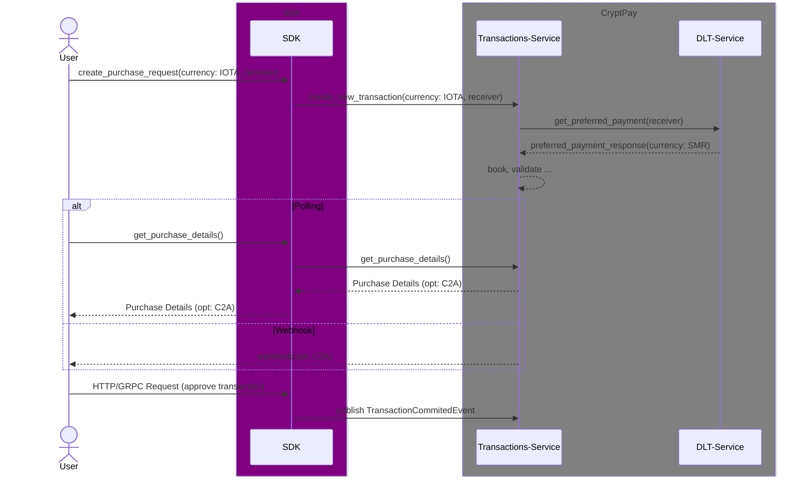

```mermaid
sequenceDiagram
    actor user as User
    box Purple SDK
        participant sdk as SDK
    end
    box Grey CryptPay
        participant tx_svc as Transactions-Service
        participant dlt_svc as DLT-Service
    end

    user->>+sdk: create_purchase_request(currency: IOTA, receiver)
    sdk->>tx_svc: create_new_transaction(currency: IOTA, receiver)
    tx_svc->>dlt_svc: get_preferred_payment(receiver)
    dlt_svc-->>tx_svc: preferred_payment_response(currency: SMR)
    tx_svc-->>tx_svc: book, validate ...
    alt Polling
    user->>sdk: get_purchase_details()
    sdk->>tx_svc: get_purchase_details()
    tx_svc-->>sdk: Purchase Details (opt: C2A)
    sdk-->>user: Purchase Details (opt: C2A)
    else Webhook
    tx_svc-->>user: webhook(opt: C2A)
    end
    user ->> sdk: HTTP/GRPC Request (approve transaction)
    sdk ->> tx_svc: publish TransactionCommitedEvent
```

