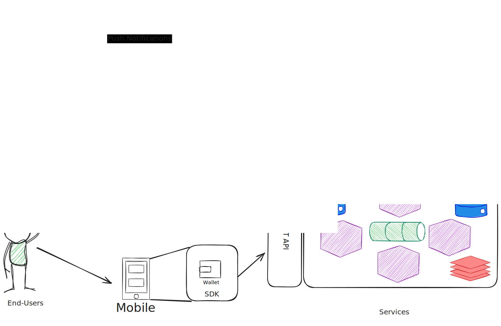

# Architecture

## Overview

The architecture shows the involved participants and explains how the integration of a client application works with .

### Services

The ETOPay services are a bundle of services, which work together, using various infrastructure components like databases, message queues, caches, etc... to provide the different features as listed [here](Features.md)

These services are maintained, tested and updated by the development team behind this project. The source code for the same is maintained in a closed source repository with the development team.

### Web portal

The developers trying to integrate the ETOPay SaaS product would typically access the web portal to register themselves. After the registration, the developer can requisition a fresh new instance for the application from ETOPay through this portal.

Additionally, the web portal allows the developers to configure their instance according to their application needs. It can be also used to undertake some application specific settings and modify them as well. For example, setting the identity provider urls and access points, which is owned by the application but may be used by ETOPay to authenticate users or setting a webhook receiver endpoint, where a notification server is already listening to ETOPay internal events, to push notifications to the end-user devices, etc...

Currently, on the first request, a staging environment of a fresh ETOPay services instance is deployed. This allows the developers to test their application flow and integration with ETOPay before moving to production. Requesting a production instance is an extra step which needs to be done additionally. This helps the developers to fix a version for their production, while they continue testing new features and releases from ETOPay team on the staging environment, before requesting to update to production.

The infrastructure deploys in a private cloud hosted in the european data center. Deployments in client infrastructure and public clouds are currently not possible, however will be considered in the future, for example with client-owned kubernetes cluster or Azure/AWS depolyments. The ETOPay services are coded in software to be fully platform agnostic. Hence, the deployment architecture does not affect the features and working of the services.

### Integration

The integration can occur for the client in three different ways:

1. REST API: A platform-agnostic, robust API to interact with the  features and a modern and sleek documentation.

    Within this integration, the ETOPay services are exposed via a REST API. The client developers can directly connect to these services using the Open API specification for the services. A drawback for this approach could be that the requirement on the various flows as expected by the ETOPay services needs to be well understood from the documentation. This approach also works only with custodial wallets, which might increase costs for end-users, as compared to a self-custody wallet.

2. SDK: A variety of multi-stack SDKs working together to allow seamless in-app integration with code examples and instructions on best-practices.

    Here, the client developers can download our SDKs and even modify their behaviour according to their own needs. These SDKs are described in detail and the source code is kept open to allow maximum benefit during integration. Using the SDK gives the advantage to the developers in a way that, the SDK does all the heavy lifting in terms of executing the flows together with the ETOPay service whilst ensuring secure self-custody wallets and user management on end-user devices. This takes away a significant amount of integration effort and allows for a quick time-to-market without needing to understand all particular nuances of ETOPay services.

3. White Label App: A multi-platform white label application with intuitive interfaces for low time to market with fully compliant flows to ensure highest user satisfaction.

    As the white label application builds on top of the SDK, it provides the client developers with complete UI/UX for maximum integration with minimal effort. The only thing the client developers would need is to adjust the corporate identiy, build the application and ship it to their end-users. The white label app ensures that all the flows are correctly executed, with the most lucid user experience from on-boarding to using the features of ETOPay. Being open source again, the white label application can also be customized for own needs and making an entirely new application would be like simply adding a few new layouts.
